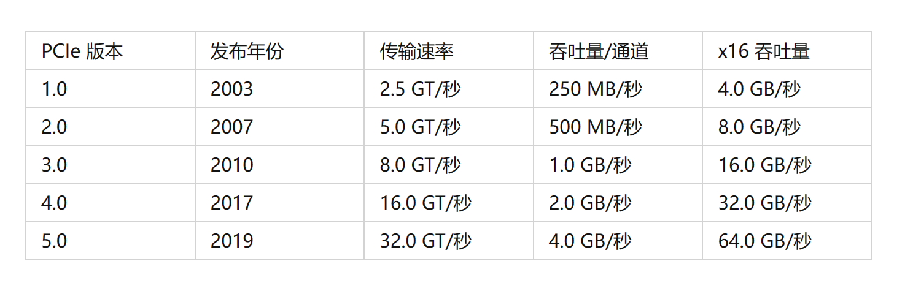

# PCIE基础

速率

PCIE3.0之前的编码标准是8b/10b，即8位数据会被编码为10位数据传输，进而产生20%的性能开销

PCIE3.0之后，采用128b/130b编码方法，性能开销减少为1.5%

## CXL（Compute Express Link)

## AVIP

/apps/cadence/vipcat-11.37/doc/pcie_avip_user_guid.pdf

# 验证策略

# 代码分析

## Baremetal下的SBSA PCIE相关测试分析

## Linux下的SBSA PCIE测试分析

## Linux下的PCIE Host驱动分析

