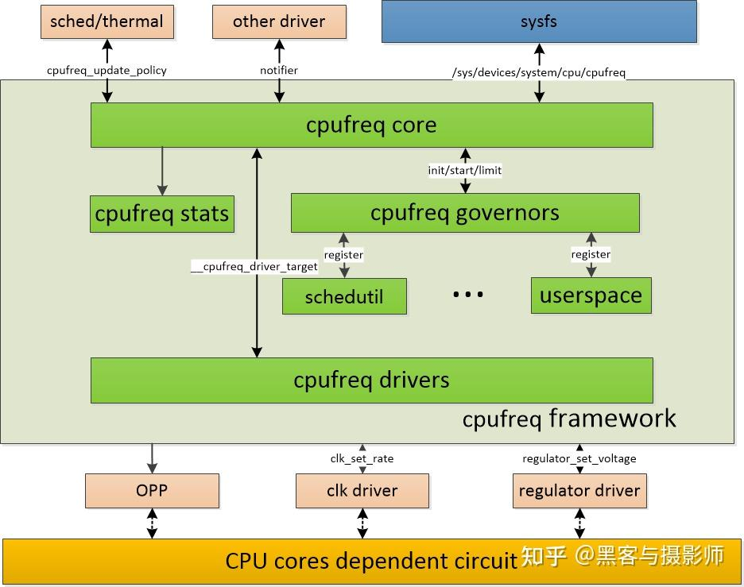

# Linux CPU DVS

> [一文搞懂linux cpu dvfs - 知乎 (zhihu.com)](https://zhuanlan.zhihu.com/p/550923783)

## 1.介绍

CPU dvfs(dynamic voltage frequency scaling)子系统负责cpu运行时，对其频率及电压进行调整，以求性能满足的前提下，cpu的功耗尽可能低。

芯片的CMOS电路的功耗有个计算公式，比较复杂，简单来说功耗跟电压平方成正比，跟频率成正比，因此CPU dvfs在涉及到电压调整的时候，功耗受益还是很明显的。但是仅调频的话，收益是比较小的，因为频率对应着算力，当频率减少，对应的算力也减弱，这样执行时间也会变长。

CPU dvfs framework（也常被称为cpufreq framework）和其他的linux framework类似，主要解决两个问题：什么时候调频调压，怎么调频调压。cpufreq driver提供调频调压的机制，cpufreq governor提供不同的策略，cpufreq core对通用的调频逻辑做抽象，为上层提供功能、接口封装，对下层调用抽象封装的硬件控制接口，此外，还借助频率电压对opp(operating performance points)功能，clk driver、regulator driver对频率及电压做时钟及电压的调整。

## 2.框架

