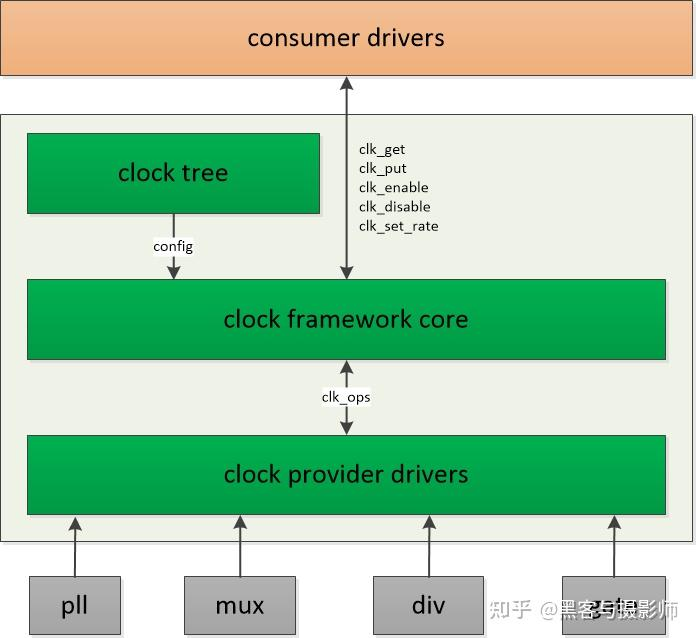
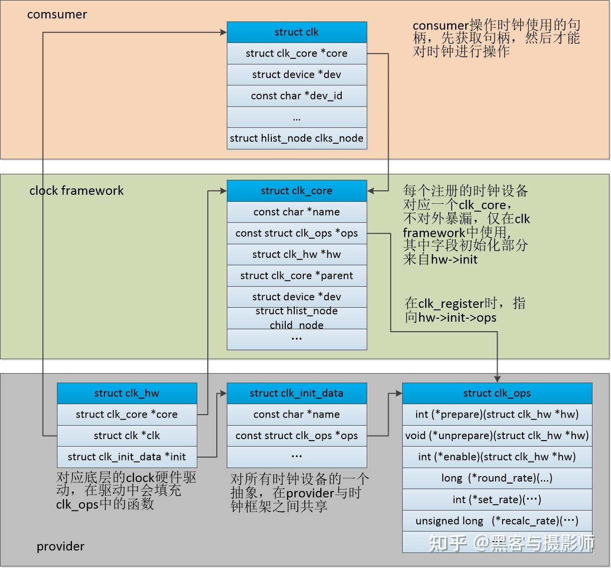
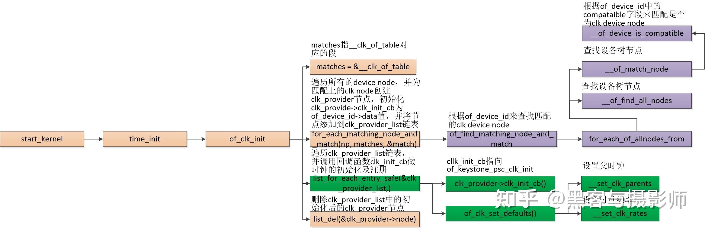
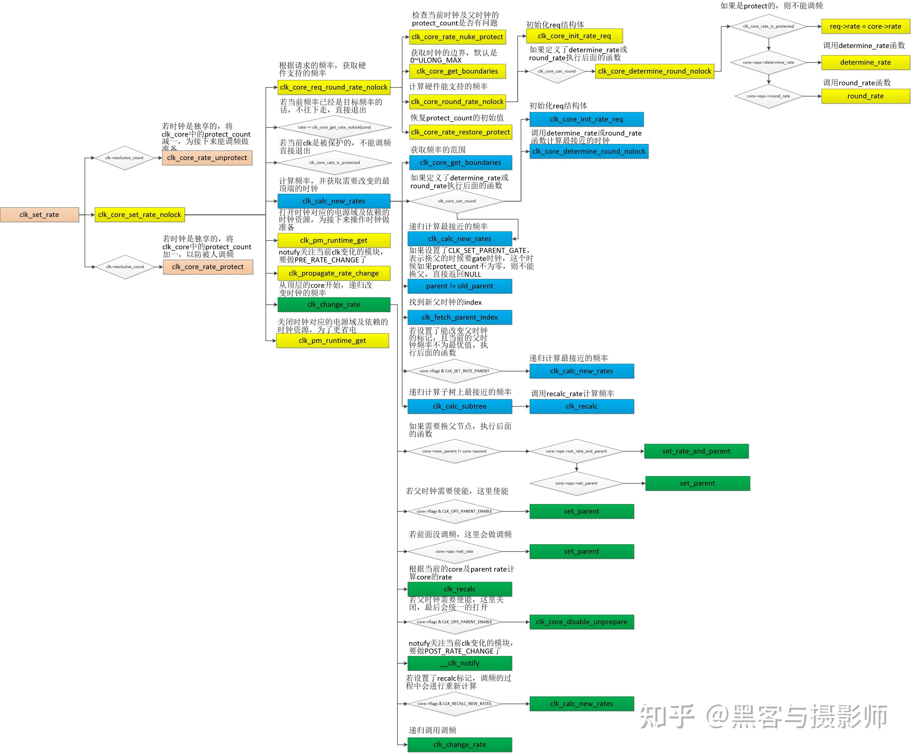

# Linux Clock子系统

> [一文搞懂linux clock子系统 - 知乎 (zhihu.com)](https://zhuanlan.zhihu.com/p/558783244)

## 1. 介绍

clock子系统在linux中属于一个比较简单，且容易理解的模块。

**时钟和电源**是系统及各模块的基础，也是电源管理中比较重要的一部分。

**时钟对应着系统的动态功耗**，会让各硬件IP做逻辑反转，从而带来能量消耗。

**涉及到时钟的电源管理主要是clk gate和调频**，通过停止或者调整时钟做到：满足功能的前提下，尽可能减少功耗。

时钟对于系统的作用就像心脏对于人的作用，可见时钟对系统的重要作用。

时钟设备由

- 晶振---用于提供时钟

- pll---用于时钟倍频

- mux---用于时钟源的选择

- div---用于时钟分频

- gate---用于时钟开关

  等硬件模块组成。

  系统中可能存在几百个这样的硬件模块，linux将他们管理成一个时钟树，根节点一般是晶振，接着是pll，然后是mux，后面会有div，最终叶子节点一般是gate。

## 2. 框架

Linux为了做好时钟管理，提供了一个时钟管理框架CCF（Common Clock Framework），由三部分组成：

- 屏蔽底层硬件操作：
  - 向上提供设置或策略接口，屏蔽底层驱动的硬件操作，提供操作clock的通用接口，如clk_enable/clk_disable，clk_set_rate/clk_get_rate等，供其它consumer使用时钟的gate、调频等功能
  - consumer使用clock framework提供的接口之前，要先获取clk句柄，通过如下接口获取：devm_clk_get/clk_get/of_clk_get
- 提供注册接口：
  - 向下给clock驱动提供注册接口，将硬件（包括晶振、PLL、MUX、DIVIDER、GATE等）相关的CLOCK控制逻辑封装成操作函数集，交给底层的Clock驱动实现
- 时钟管理的核心逻辑
  - 中间是CLOCK控制的通用逻辑，与硬件无关

## 3. 数据结构

通过of_clk_add_provider根据device_node来添加节点到全局链表of_clk_providers中，方便of_get_clk获取clk结构。

通过clk_register将struct clk_hw结构注册到clock框架，其中clk_hw包含了对硬件的操作及相关的一些变量。

通过clk_core结构来维护一个clock tree，通过clk->core->ops来回调实际clock驱动中的硬件操作接口。

当consumer想使用clock资源的时候，会通过clk_get/devm_clk_get/of_get_clk等接口获取struct clk句柄。

struct clk_hw将struct clk_core与struct clk绑定在一起，同时struct clk_hw中包含了对硬件的操作函数，需要填充这个数据结构并注册到clock framework中。

一个struct clk_hw对应一个struct clk_core，但是可以对应多个struct clk，这些clk维护在一个链表中。

## 4. 流程分析

### 4.1 注册流程

略

### 4.2 初始化流程

### 4.3 时钟调频流程

