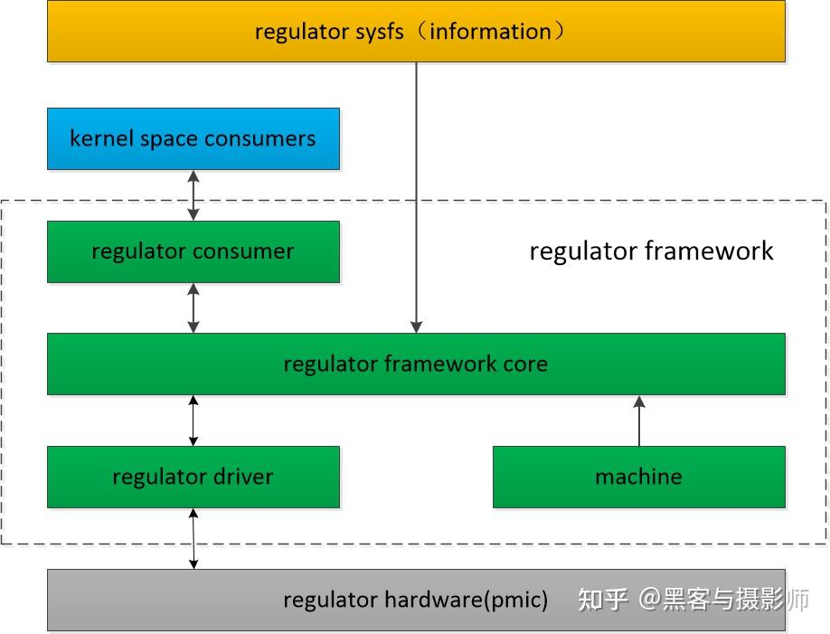
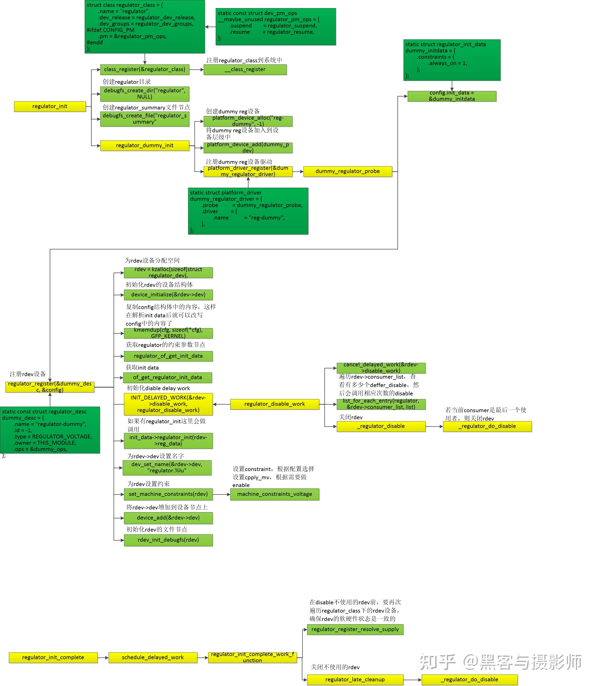
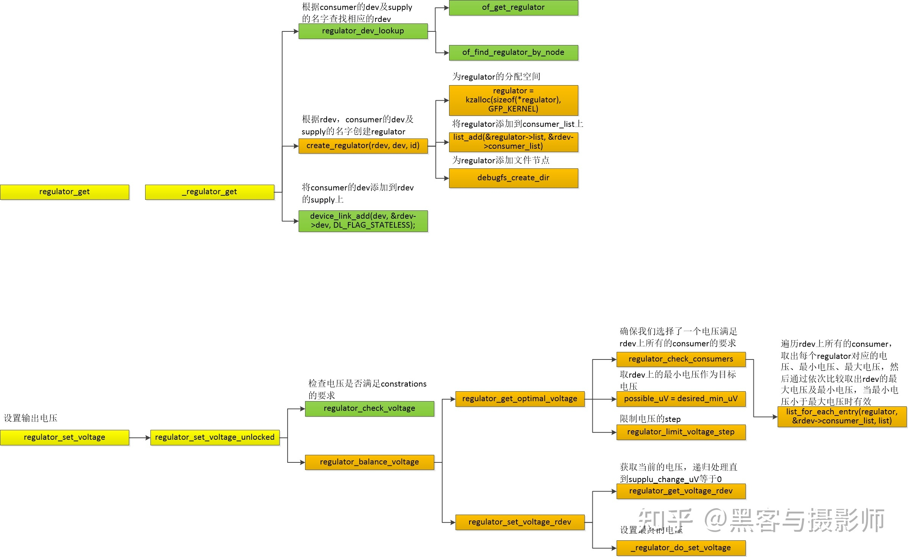

# Linux Regulator子系统

> [一文搞懂linux regulator子系统 - 知乎 (zhihu.com)](https://zhuanlan.zhihu.com/p/565532795)

## 1.介绍

Regulator指的是稳定器，有电压稳定器及电流稳定器两种，能够自动维持恒定电流或者电压。

其中，电压稳定器voltage regulator在电路中比较常见。

从设备驱动的角度来看，regulator的控制比较简单，主要有enable/disable/输出电压或电流大小的控制。

Linux利用regulator framework对regulator进行管理和控制。

Linux regulator framework的主要目的：提供标准的内核接口，控制系统的voltage/current regulators，并提供相应的开关、大小设置的机制。在系统运行的过程中，根据具体的需要动态改变regulators的输出，从而达到省电的目的。

在系统中如果配错regulator是比较危险的，可能会造成硬件器件的损坏。

因此，需要在regulator framework中对电流或者电压的大小做限定，并且不能被ragulator的consumer或者provider更改。

稳定器

- 电压稳定器---维持恒定电压
  - enable
  - disable
  - 设置输出的电压
- 电流稳定器---维持恒定电流
  - enable
  - disable
  - 设置输出的电流
- 在系统运行过程忠，根据具体的需要动态改变稳定器的输出，从而达到省电的目的。

## 2.框架

### 2.1 Machine

machin使用struct regulator_init_data，静态的描述regulator在板级的硬件连接情况，这些限制通过驱动或dts配置，涉及到系统供电安全，因此必须小心，这些配置主要包括：

1. 用于描述regulator在板级的级联关系：
   - 前级regulator：该regulator的输出是另外一个regulator的输入，称为supply regulator
   - 后级regulator：该regulator的输入是其它regulator的输出，称为consumer regulator
2. 利用struct regulation_constraints 描述regulator的物理限制，比如：
   - 输出电压的最大值和最小值（voltage regulator）
   - 输出电流的最大值和最小值（current regulator）
   - 允许的操作（修改电压值、修改电流限制、enable、disable等）
   - 输入电压是多少（当输入是另一个regulator时）
   - 是否不允许关闭（always_on）
   - 是否启动时就要打开（always_on）

### 2.2 regulator driver

regulator driver指的是regulator设备的驱动，主要包含如下结构：

1. 使用struct regulator_desc，描述regulator的静态信息，包括：

   - 名字
   - supply regulator的名字
   - 中断号
   - 操作函数集（struct regulator_ops）
   - 使用regmap时相应的寄存器即bitmap等

2. 使用struct regulator_config，描述regulator的动态信息，包括：

   - struct regulator_init_data指针
   - 设备指针
   - enable gpio等

3. 提供regulator的注册接口：

   - regulator_register

   - devm_regulator_register

     该接口接受描述该regulator的两个变量的指针，并分配一个新的数据结构（struct regulator_dev，从设备的角度描述regulator），并把静态指针（struct regulator_desc）和动态指针（struct regulator_config）提供的信息保存在其中

4. regulator driver以struct regulator_dev（代表设备）指针为对象，对regulator进行后续的操作

### 2.3 regulator consumer

regulator consumer抽象出regulator设备（struct regulator），并提供regulator操作相关的接口。包括：

- regulator_get
- regulator_put
- regulator_enable
- regulator_disable
- regulator_set_voltage
- regulator_get_voltage等

### 2.4 regulator core

regulator core负责上述regulator driver/consumer/machine逻辑的具体实现，对底层的硬件进行封装，并提供接口给内核中其他的consumer（使用当前regulator设备的驱动）提供操作接口，并以sysfs的形式，向用户空间提供接口。

## 3. 数据结构

略

## 4. 流程

### 4.1 初始化流程

### 4.2 调压流程

调压前要先获取regulator handle，然后利用regulator_set_voltage进行调压

