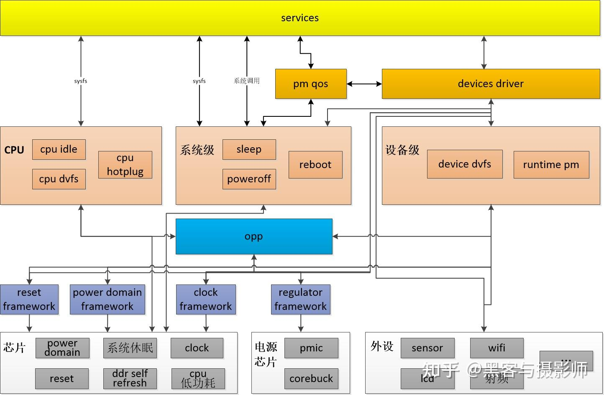
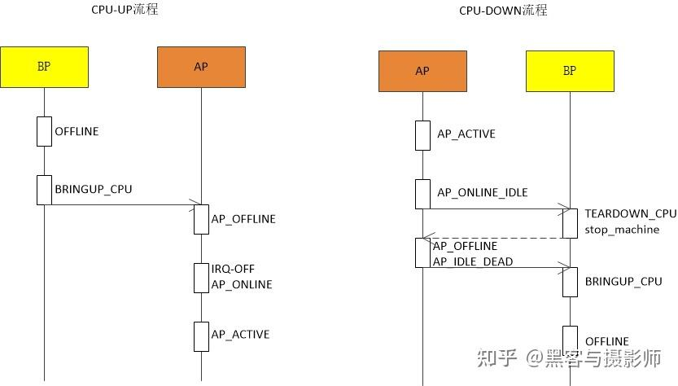

# Linux电源管理（合集）

> [一文搞懂Linux电源管理（合集） - 知乎 (zhihu.com)](https://zhuanlan.zhihu.com/p/580754972)

## 1. 介绍

Linux提供了多种电源管理方式：

- 为了解决系统不工作时的功耗消耗，Linux提供：
  - 休眠（suspend to ram/ suspend to disk)
  - 关机（Power Off）
  - 复位（Reboot）
- 为了解决运行时不必要的功耗消耗，Linux提供：
  - runtime PM
  - cpu/device dvfs
  - cpu hotplug
  - cpu idle
  - clock gate
  - reset
- 为了解决运行时电源管理对性能的影响，Linux提供了PM QOS功能：
  - 用于平衡性能与功耗，既降低功耗，又不影响性能

## 2. 框架

功耗管理不仅是软件的逻辑，还需要硬件功能的支撑。硬件设计决定了功耗的下限，热设计决定了功耗的上限，而软件就是通过一些机制及策略将功耗尽可能逼近硬件功耗下限。

芯片上支持的低功耗机制包括：PowerDomain、Reset、Clock、系统休眠/唤醒、CPU的低功耗、DDR自刷新等。

系统一般通过PMIC芯片控制供应给各个器件的电压、电流大小及有无。

外设也支持低功耗模式，或者他们的供电能被打开和关闭。

芯片、电源芯片、系统外设之上，便是各个硬件低功耗功能对应的管理框架：

- Clock Framework：时钟管理框架，统一管理系统的时钟资源，包括PLL/MUX/DIV/GATE等，对时钟资源操作做封装，维护成一个时钟树，抽象频率获取、频率设置、时钟开关等核心逻辑，为其它驱动子模块提供频率调整、频率查询、使能、去使能等接口；
- Regulator Framework：电压管理框架，统一管理系统的供电资源，这些供电资源包括PMIC、corebuck等，对供电资源操作做封装，一般通过I2C、SPI、GPIO、PWM等控制供电资源的电压、电流调整或者开/关，为其它驱动或者框架提供电压、电流调整、开关等接口；
- Power Domain Framework：PowerDomain管理框架，统一管理芯片的PowerDomain，对芯片内的PowerDomain开关操作做封装，抽象核心的开关处理逻辑，为runtime pm、系统休眠唤醒提供开关等接口；
- Reset Framework：Reset管理框架，统一管理芯片的复位，对芯片内的reset、dereset寄存器操作做封装，抽象核心的reset/dereset处理逻辑，为其它驱动提供统一的reset/dereset等接口；
- OPP Framework：OPP（Operating Performance Point）管理框架，统一管理使CPU或Device正常工作的电压和频率组合。内核提供这个Layer，是为了给出一些相对固定的电压和频率组合，从而使调频调压变得更为简单；
- Runtime PM：Runtime PM管理框架，统一管理片内设备及相应Power Domain硬件操作。是在Power Domain提供的开关接口及设备运行时对应的时钟、复位、电的管理基础之上做的封装，设备会在dts指定具体的Power Domain，设备驱动通过在runtime_suspend、runtime_resume实现对时钟、复位、电的管理，然后注册到runtime pm框架。runtime pm为设备提供了pm_runtime_get_xxx/pm_runtime_put_xxx类接口，让设备进入低功耗，当power domain下所有的设备都进低功耗后，就可以关闭power domain，当power domain下有一个设备需要工作时，就要打开power domain；
- Device DVFS：Device DVFS管理框架，统一管理设备的频率和电压调整，利用OPP Framework提供的接口，根据设备驱动给定的频率进行调频调压，跟CPU DVFS类似；
- Sleep：系统休眠唤醒能在系统不被使用的时候，进入一个功耗很低的状态，芯片功耗会很低，DDR进入自刷新，并在系统被使用的时候，能够快速的恢复。休眠唤醒的过程中会调用device提供的system suspend、resume函数，调用power domain提供的suspend、resume函数，会关闭、打开cpuidle、cpuhotplug功能；
- Reboot/Poweroff：系统重启/关机
- CPU Idle：CPU IDLE管理框架，会根据当前一段时间CPU的空闲状态及接下来空闲时间的预估，选择进入相应idle等级，不同的等级功耗收益不同，进出时间也不一样，一般功耗收益低，但对应着比较少的退出时间。
- CPU DVFS：CPU DEVS管理框架，提供了不同governor，用来控制CPU的频率、电压调整，这些governor有完全把CPU DVFS交给用户service的，用户service根据场景的不同进行相应的频率、电压调整；也有根据负载进行动态频率、电压调整的；
- CPU Hotplug：提供了一种机制给service，当前空闲的CPU loading比较多时，会由service直接off掉一些core，当cpu loading的需求增加时，再由service将cpu on
- PM QOS：是解决低功耗可能会降低性能的问题，它向驱动或者上层service提供了一套对性能约束要求的接口，在cpu dvfs、cpu idle等低功耗管理的时候，会检查性能的约束要求，当发现低功耗动作会影响到性能的时候，便不会进行该次的低功耗操作。

上层service会有专门的功耗管理应用，用来协调其它service进入休眠、唤醒，在进入不同场景的时候告知各service做相应的功耗策略。

## 3. 内核中各种低功耗管理模块框架

### 3.1 clock framework

### 3.2 CPU Hotplug

