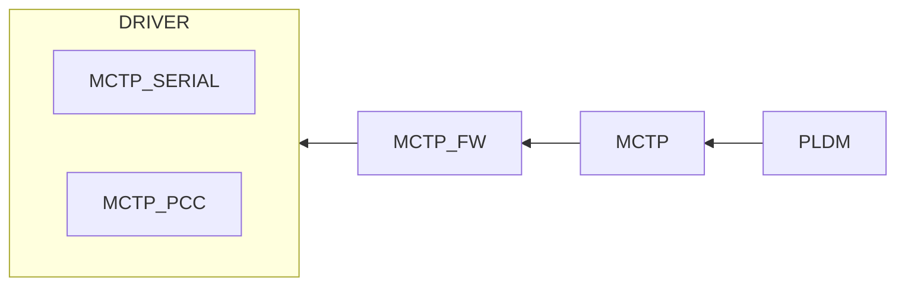
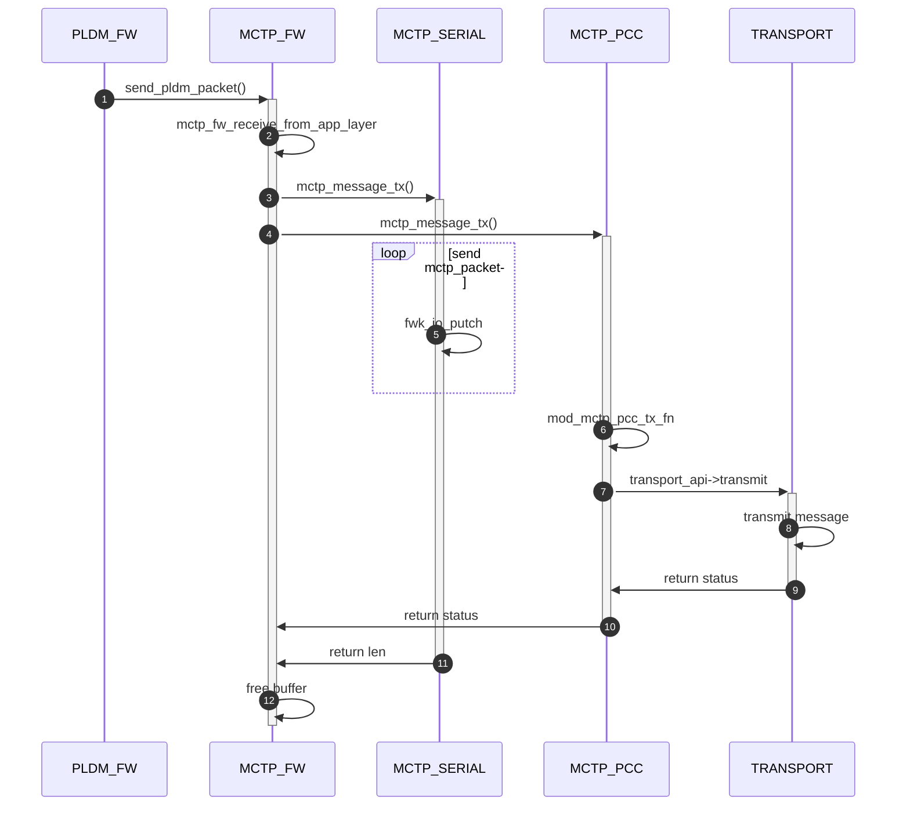
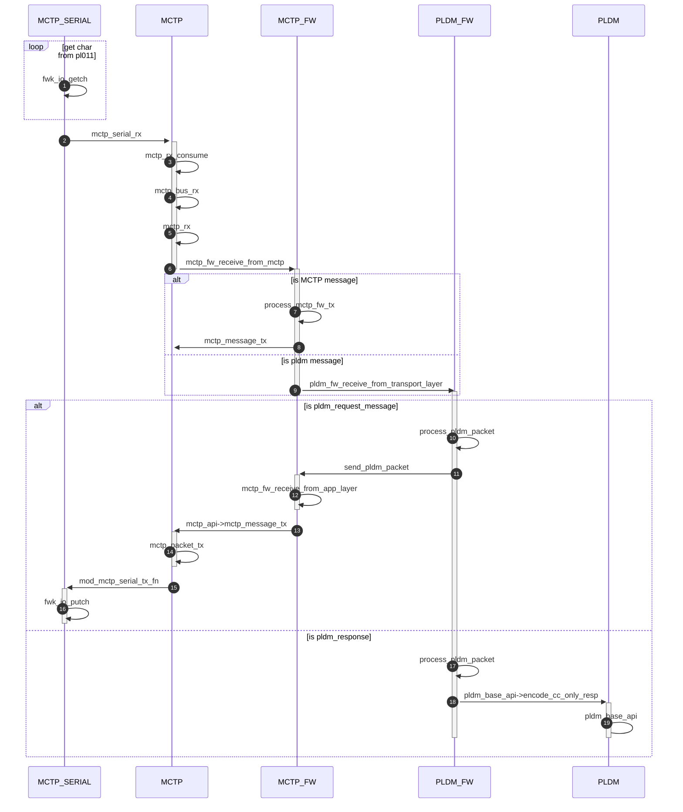

# MCTP和PLDM调用流程分析

## 模块设计框图

## 从应用层发送消息的物理层的时序图

1. PLDM_FW模块，或其它应用层，调用mctp_fw_api.mctp_fw_receive_from_app_layer()接口，将协议层消息下发到MCTP传输层
2. MCTP_FW模块，添加MCTP消息头，调用process_mctp_fw_tx，具体调用mctp_api->mctp_message_tx，将消息发给物理层（Serial或PCC）
3. 如果物理层走MCTP_Serial，则调用MCTP_SERIAL模块注册的tx接口：mod_mctp_serial_tx_fn
4. 如果物理层走MCTP_PCC，则调用MCTP_PCC模块注册的tx接口：mod_mctp_pcc_tx_fn

## 从物理层收到消息并交给协议栈处理流程图

1. 物理层为Serial，则在mod_mctp_serial.c模块文件里，用到了TIMER定时器，周期性的轮询串口，将接收到的字符上传给MCTP核心层
2. 物理层为PCC，待分析
3. MCTP核心层，负责解析从串口接收的原始字节流，并组装成完整的MCTP数据包，然后调用mctp_bus_rx将数据包传递给MCTP核心协议栈
4. MCTP核心层通过mctp_set_rx_all注册的回调接口（mod_mctp_fw.c里，通过mctp_api->mctp_set_rx_all，注册了mctp_fw_receive_from_mctp），进一步将数据传递给应用层（如PLDM）
5. PLDM应用层，通过接口pldm_fw_receive_from_transport_layer，处理MCTP核心层送上来的报文。

