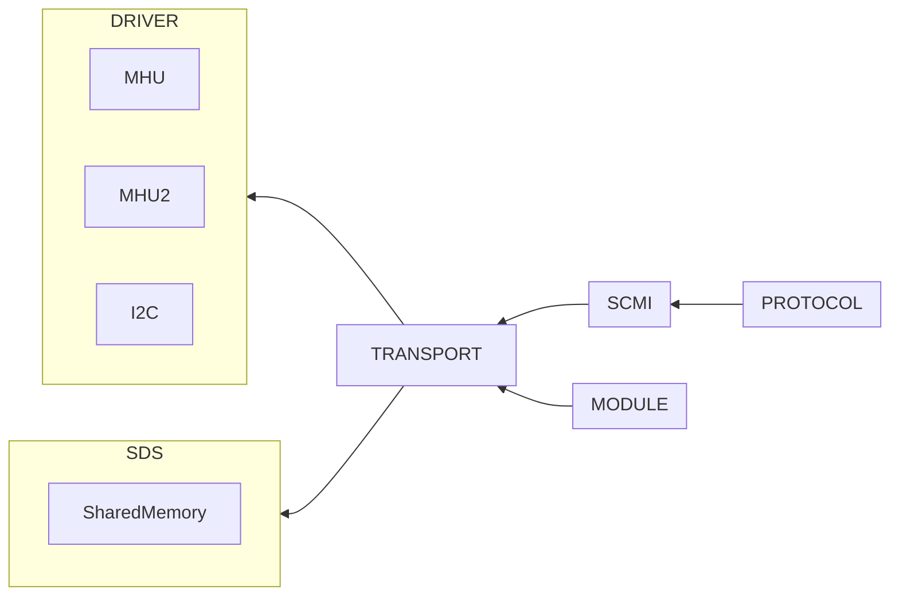
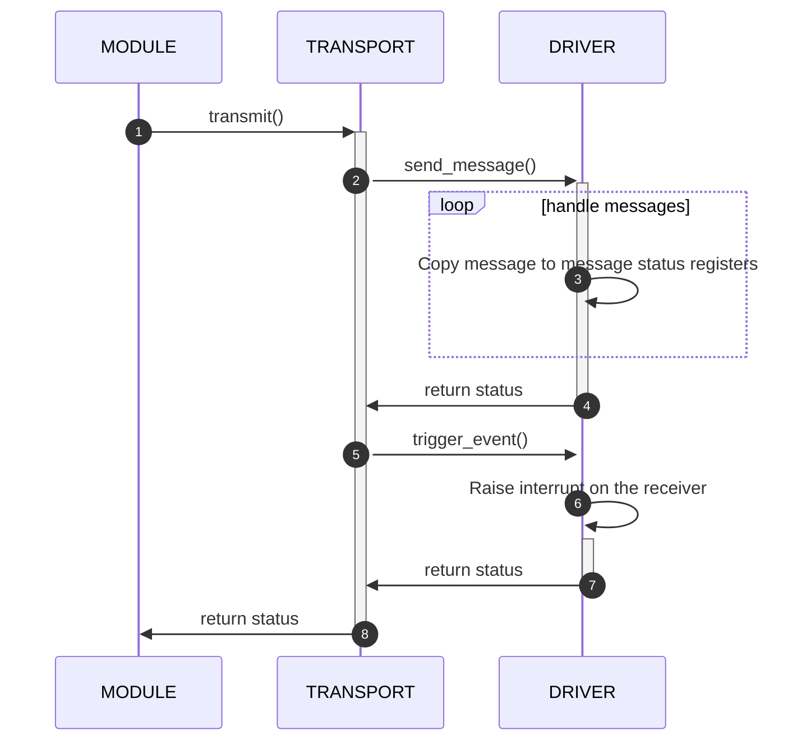
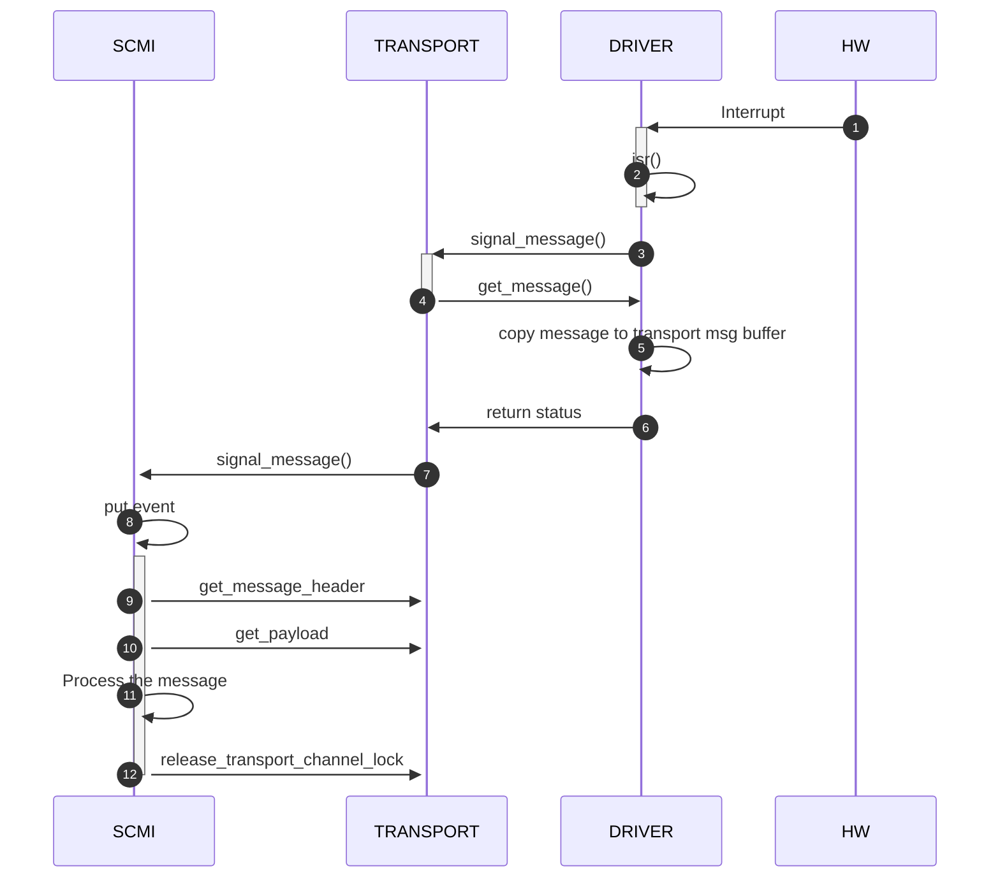
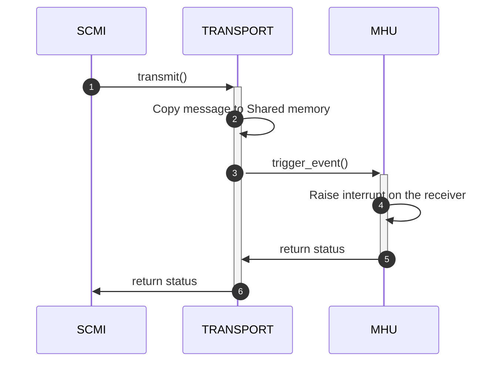
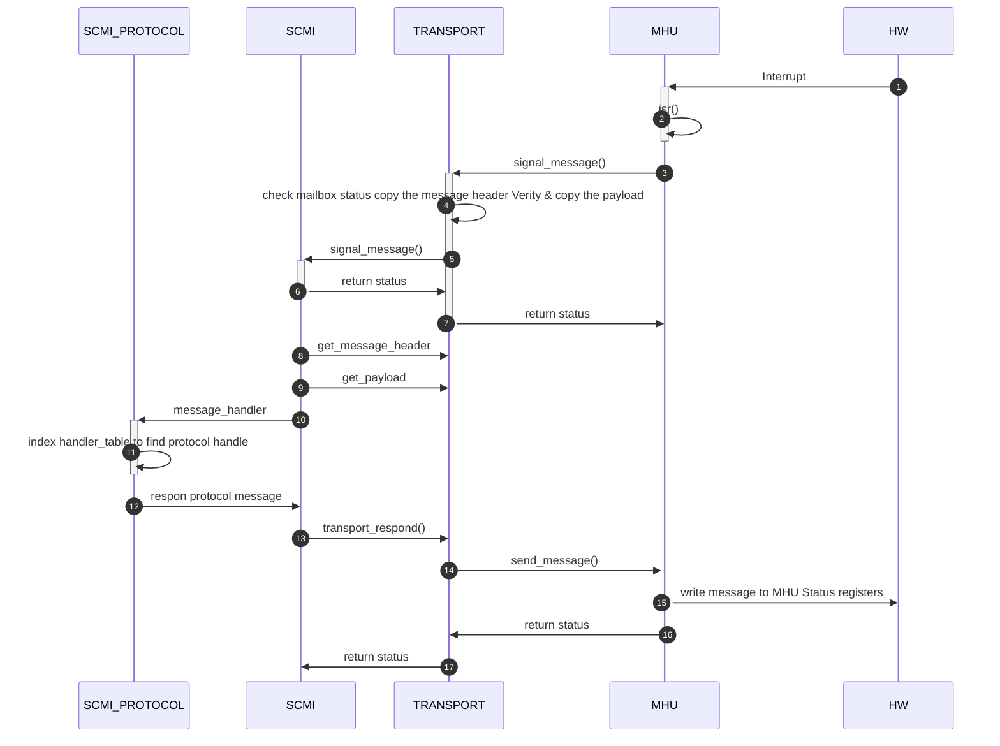

# scp transport分析

## 概述

TRANSPORT模块实现了用于SOC片内通信的消息HAL API。

**注意：SMT模块将会被废弃，改为使用TRANSPORT模块**

## 模块设计框图

TRANSPORT模块定义了发送和接收数据的API接口，所有支持TRANSPORT的驱动需要实现此API接口，如MHU、MHUv2，它同样定义了收到消息后通知client module的signale接口




## IN-BAND消息通信

### 发送消息流程

- SCMI模块调用传输模块的transmit() API，发送SCMI消息；
  - scmi_send_message--->transport_api->transmit
- 传输模块调用MHU2驱动模块的send_message() API，通过物理层发送消息；
- 驱动模块实现send_message() API，通过MHU，将消息发送出去
- 传输模块调用MHU2驱动模块的trigger_event() API，使能MHU的接收消息，等待MHU2产生接收消息中断



### 接收消息流程

- mhuv2驱动模块收到消息到达的中断，调用传输模块的signal_message() API，告诉传输模块有新的消息到达了；
- 传输模块通过调用驱动模块的get_message() API，获取驱动模块收到的消息；
- 驱动模块实现get_message() API，将收到的消息放到传输模块给定的buffer里；
- 传输模块调用SCMI模块的signal_message() API，通知SCMI模块处理收到的消息；
- SCMI模块解析消息包头、payload，并处理收到的消息



## OUT-BAND消息通信

### 发送消息

- 通过TRANSPORT模块将待发送的消息放到共享内存
- 调用MHU驱动模块提供的trigger_event() API，通知接收模块



### 接收消息



## Fast Channels通信

从代码分析，目前还没有模块支持快速channel通信，暂不分析


# 如何使用

## TRANSPORT

- Transport Type
  - OUT_BAND：共享内存
  - IN_BAND：MHU、I2C等
- Channel Type
  - Requester：请求者
  - Completer：接收者

示例，SCP里Transport提供SCMI协议服务，配置如下：

```c
static const struct fwk_element transport_element_table[] = {
    [SCP_PLATFORM_SCMI_SERVICE_IDX_PSCI] = {
        .name = "PSCI",
        .data = &((
            struct mod_transport_channel_config) {
            .channel_type = MOD_TRANSPORT_CHANNEL_TYPE_COMPLETER,
            .policies = MOD_TRANSPORT_POLICY_INIT_MAILBOX | MOD_TRANSPORT_POLICY_SECURE,
            .out_band_mailbox_address = (uintptr_t) SCP_SCMI_PAYLOAD_S_A2P_BASE,	//0xa4000dc0
            .out_band_mailbox_size = SCP_SCMI_PAYLOAD_SIZE,
            .driver_id =
                FWK_ID_SUB_ELEMENT_INIT(
                    FWK_MODULE_IDX_MHU2,
                    SCP_PLATFORM_MHU_DEVICE_IDX_SCP_AP_S_CLUS0,
                    0),
            .driver_api_id =
                FWK_ID_API_INIT(
                    FWK_MODULE_IDX_MHU2,
                    0),
        }),
    },
```

其中Transport Type没有定义，默认就是OUT_BAND

Channel Type定义为Completer，即用于接收SCMI消息

使用方式为：

1. SCP将共享内存区域状态初始化为FREE
2. AP需要发送SCMI消息时，检查SCP---AP共享内存区域为FREE，则将SCMI消息填充到共享内存区
3. AP通过MHU Doorbell，通知SCP，有新的SCMI消息需要处理
4. SCP收到doorbell消息，将共享内存区的消息取出，解析出协议ID、消息类型，再调用对应的SCMI协议进行消息处理
5. SCP的SCMI协议栈处理完消息，将答复写入到共享内存，使用MHU通知AP查收回复的消息


## SCMI消息

SCMI消息由mod_scmi.c模块处理，SCMI模块又会调用transport模块的API发送消息。

需要使用SCMI模块消息的module，需要绑定SCMI模块提供的API:scmi_send_message()


## 配置示例

```c

static const struct fwk_element transport_element_table[] = {
    [0] = {
        .name = "SCP2MCP_SCMI_TRANSPORT",
        .data = &((
            struct mod_transport_channel_config) {
            .transport_type = MOD_TRANSPORT_CHANNEL_TRANSPORT_TYPE_IN_BAND,
            .channel_type = MOD_TRANSPORT_CHANNEL_TYPE_REQUESTER,
            .in_band_mailbox_size = SCP_SCMI_PAYLOAD_SIZE,
            .driver_id =
                FWK_ID_SUB_ELEMENT_INIT(
                    FWK_MODULE_IDX_MHU2,
                    SCP_PLATFORM_MHU_DEVICE_IDX_SCP2MCP,
                    0),
            .driver_api_id =
                FWK_ID_API_INIT(
                    FWK_MODULE_IDX_MHU2,
                    1),
        }),
    },
    [1] = {
        .name = "SCP2MCP_FIRMWARE_TRANSPORT",
        .data = &((
            struct mod_transport_channel_config) {
            .transport_type = MOD_TRANSPORT_CHANNEL_TRANSPORT_TYPE_OUT_BAND,
            .channel_type = MOD_TRANSPORT_CHANNEL_TYPE_COMPLETER,
            .policies =  MOD_TRANSPORT_POLICY_INIT_MAILBOX,
            .out_band_mailbox_address = (uintptr_t) SCP_PAYLOAD_NS_A2P_BASE,
            .out_band_mailbox_size = SCP_PAYLOAD_SIZE,
            .signal_api_id = FWK_ID_API_INIT(
                                FWK_MODULE_IDX_TEST,
                                0),
            .driver_id =
                FWK_ID_SUB_ELEMENT_INIT(
                    FWK_MODULE_IDX_MHU2,
                    SCP_PLATFORM_MHU_DEVICE_IDX_SCP2MCP,
                    1),
            .driver_api_id =
                FWK_ID_API_INIT(
                    FWK_MODULE_IDX_MHU2,
                    1),
        }),
    },
    [2] = {
        .name = "SCP2MCP_EVENT",
        .data = &((
            struct mod_transport_channel_config) {
            .transport_type = MOD_TRANSPORT_CHANNEL_TRANSPORT_TYPE_NONE,
            .signal_api_id = FWK_ID_API_INIT(
                                FWK_MODULE_IDX_TEST,
                                0),
            .driver_id =
                FWK_ID_SUB_ELEMENT_INIT(
                    FWK_MODULE_IDX_MHU2,
                    SCP_PLATFORM_MHU_DEVICE_IDX_SCP2MCP,
                    2),
            .driver_api_id =
                FWK_ID_API_INIT(
                    FWK_MODULE_IDX_MHU2,
                    1),
        }),
    },
    [3] = { 0 },
};

static const struct fwk_element *transport_get_element_table(fwk_id_t module_id)
{
    unsigned int idx = 1;
    struct mod_transport_channel_config *config;

    config = (struct mod_transport_channel_config *)(transport_element_table[idx].data);
    config->pd_source_id = FWK_ID_ELEMENT(
        FWK_MODULE_IDX_POWER_DOMAIN,
        platform_get_core_count() + platform_get_cluster_count() +
            PD_STATIC_DEV_IDX_SYSTOP);

    return transport_element_table;
}

const struct fwk_module_config config_transport = {
    .elements = FWK_MODULE_DYNAMIC_ELEMENTS(transport_get_element_table),
};
```


