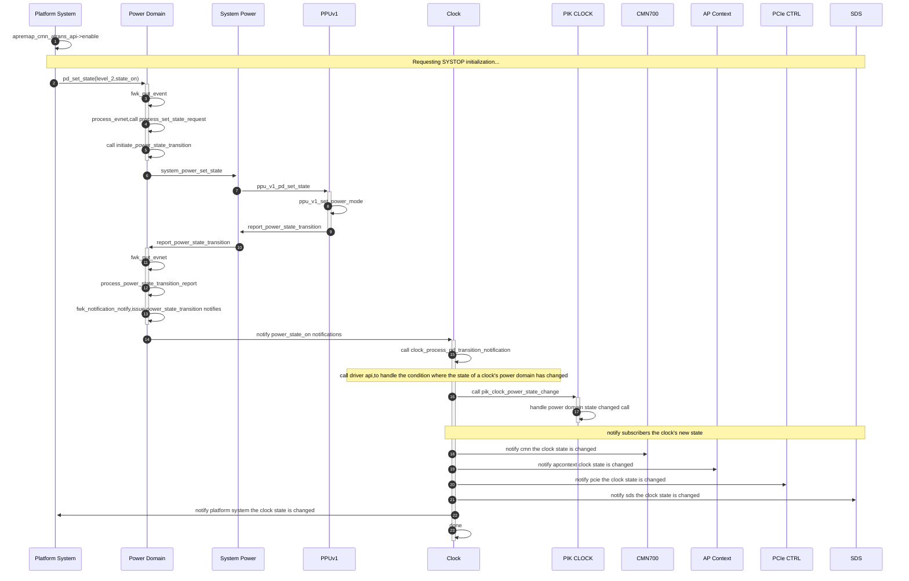

# 电源和时钟分析

## 上电流程分析

流程总结：

- platform_system发起上电流程，使能cmn地址转换访问，调用power domain的api，通知电源域改变电源状态
- power domain初始上电event，调用power domain的api，设置电源状态
- power domain调用system power的api，设置电源状态
- system power调用ppuv1的set state API，设置电源状态
- ppuv1调用system power的api，向system power报告上电状况
- system power调用power domain的api，向power domain报告上电状况
- power domain得知修改后的电源状态，调用fwk_notification_notify，通知clock，transport，pl011模块，systemtop电源域已ready
- transport模块，会初始化与AP通信的mailbox，即访问ap secure sram并初始化通道为free（此时，CMN还没有初始化，如果HND节点使能了默认路由，则访问0xa4000000是可以的，否则，SCP会因为访问不到0xa4000000而挂死）
  - FPGA上，技术原型版本，默认HND节点的默认路由没有使能，因此CMN未配置的情况下，SCP是不能访问0xa4000000地址
  - EMU或FVP上，参考设计，默认使能了CMN HND默认路由，因此在CMN未初始化的情况下，SCP可以进行mailbox通道的初始化配置

- clock调用pik_clock的api，设置对应的clock频率
- clock频率设置完成后，调用fwk_notification_notify，通知cmn、apcontext、pcie、sds、platform_system，clock state RUNNING/STOPED
- cmn模块收到时钟RUNNING通知后，开始cmn discovery和rsam配置
- apcontext模块收到时钟RUNNING通知后，调用apcontext_zero，清空SDS共享内存区域
- pcie模块收到时钟RUNNING通知后，disable cmn地址转换访问，配置PCIE INT CTRL寄存器
- SDS模块收到时钟RUNNING通知后，初始化sds内存区域
- platform system模块收到时钟RUNNING通知后，再次调用power domain的set_state API，设置新的电源状态，并取消订阅CLOCK模块的通知



## PPU寄存器

### 1.SYSTEM_TOP

```c
//ppu turn system top on
*(uint32 *)0x50041000 = 0x8;
    
//ppu turn system top off
*(uint32 *)0x50041000 = 0x0;

//ppu system top warm reset
*(uint32 *)0x50041000 = 0x9;
```


###  2.CLUSTER&&CORE

```c
//ppu turn ap cluster on
*(uint32 *)0xc0030000 = 0x8;

//ppu turn ap core on
*(uint32 *)0xc0080000 = 0x8;
```


## CLOCK & PIK Clock


SCP Power Control registers:	0x50000000   64KB

Debug Power Integration Kit registers:	0x50020000 64KB

System Power Integration Kit registers:	0x50040000	64KB


SCP_PIK_SYSTEM_BASE	0x50040000

SCP_PIK_SCP_BASE			0x50000000


EMU上，SYS_PLL参考时钟是2400MHZ，设置APUARTCLKK的分频值为4，即进行4分频，得到AP UART参考时钟为600MHZ

### CLOCK模块

模块类型是HAL


